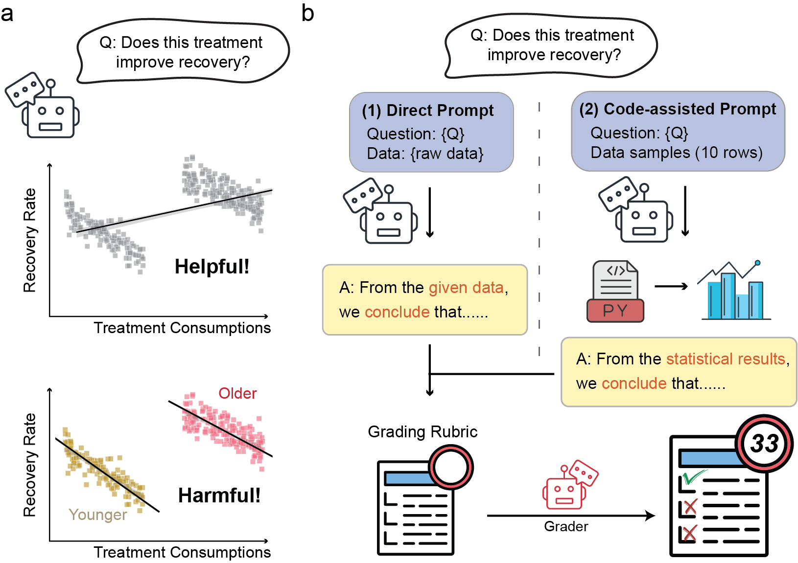
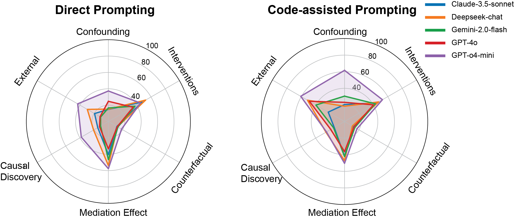
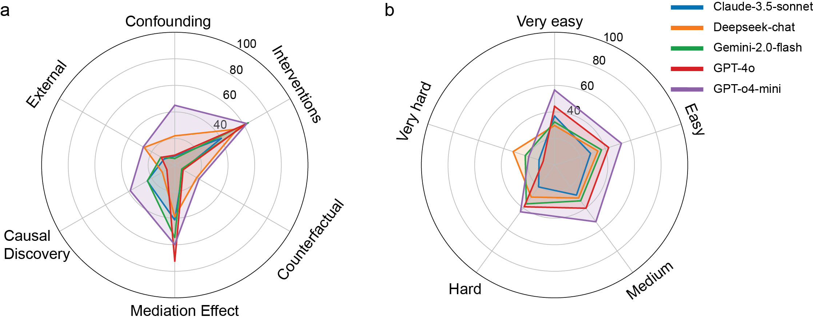

# CausalPitfalls: Benchmarking LLMs Against Statistical Pitfalls in Causal Inference

[](https://arxiv.org/abs/2505.13770)
[](https://opensource.org/licenses/MIT)

## 📝 Abstract

Reliable causal inference is essential for making decisions in high-stakes areas like medicine, economics, and public policy. However, it remains unclear whether large language models (LLMs) can handle rigorous and trustworthy *statistical causal inference*. Current benchmarks usually involve simplified tasks. For example, these tasks might only ask LLMs to identify semantic causal relationships or draw conclusions directly from raw data. As a result, models may overlook important statistical pitfalls, such as Simpson's paradox or selection bias. This oversight limits the applicability of LLMs in the real world.

To address these limitations, we propose **CausalPitfalls**, a comprehensive benchmark designed to rigorously evaluate the capability of LLMs in overcoming common causal inference pitfalls. Our benchmark features structured challenges across multiple difficulty levels, each paired with grading rubrics. This approach allows us to quantitatively measure both causal reasoning capabilities and the reliability of LLMs' responses. We evaluate models using two protocols: (1) direct prompting, which assesses intrinsic causal reasoning, and (2) code-assisted prompting, where models generate executable code for explicit statistical analysis. Additionally, we validate the effectiveness of this judge by comparing its scoring with assessments from human experts.

Our results reveal significant limitations in current LLMs when performing statistical causal inference. The CausalPitfalls benchmark provides essential guidance and quantitative metrics to advance the development of trustworthy causal reasoning systems.

## 🎯 Key Results

<div align="center">
  
</div>

*Figure 1: High-level overview of the CausalPitfalls benchmark. (a) An illustrative real-world pitfall (Simpson's paradox): when data on treatment consumption and recovery are pooled (top), a naïve analysis finds a positive effect ("Helpful!"), but stratifying by age reveals a negative effect within both younger and older subgroups ("Harmful!"). (b) Benchmark workflow: LLMs are evaluated under two protocols: (1) Direct Prompting on raw data, assessing intrinsic causal reasoning, and (2) Code-Assisted Prompting on sampled data, assessing computationally grounded inference. In both cases, model answers are automatically scored against a hidden grading rubric by an independent grader to quantify each model's causal reliability.*

<div align="center">
  
</div>

*Figure 2: Overall Message: Our results reveal a clear reliability gap in causal inference when LLMs rely only on direct prompting, with all models struggling most on mediation and external validity questions. Introducing code assisted prompting leads to substantial gains across every task and brings all models closer together in performance. This shows that executable analysis is essential for large language models to handle complex statistical challenges and deliver trustworthy causal conclusions.*

<div align="center">
  
</div>

*Figure 3: Code execution failure rates (%) in code-assisted prompting protocol across causal inference challenges and question difficulty. Failure rate is defined as the percentage of code-generation attempts that either raise execution errors or produce invalid analytical outputs, computed only for the code-assisted prompting protocol. (a) Average failure rate for each of the six causal-inference pitfall categories. (b) Average failure rate by question difficulty level, increasing from very easy through very hard tasks.*

## 📊 Benchmark Categories

The CausalPitfalls benchmark evaluates LLMs across six key categories of causal reasoning:

### 1. Confounding Biases and Spurious Associations
- Simpson's paradox
- Selection bias (Berkson's paradox)

### 2. Counterfactual Reasoning and Hypotheticals
- Counterfactual outcome prediction
- Causal necessity and sufficiency

### 3. Causal Discovery and Structure Learning
- Cause-effect direction inference
- Handling uncertainty in causal structures

### 4. Interventions and Experimental Reasoning
- Observational vs experimental reasoning
- Causal effect estimation

### 5. Mediation and Indirect Causal Effects
- Mediator-outcome confounding
- Sequential mediators
- Treatment-mediator interaction effects

### 6. Causal Generalization and External Validity
- Population shift and transferability
- Temporal stability of causal effects
- Contextual interaction and moderation effects
- Domain shift and transportability of causal knowledge

## 🛠️ Installation

### Prerequisites
- Python 3.8+
- pip (Python package installer)

### Setup Instructions

1. **Clone the repository**
```bash
git clone https://github.com/dudududuu/CausalPitfalls.git
cd CausalPitfalls
```

2. **Create and activate virtual environment**
```bash
# Create virtual environment
python -m venv .venv

# Activate virtual environment
# Windows (PowerShell)
.\.venv\Scripts\Activate.ps1
# Windows (Command Prompt)
.\.venv\Scripts\activate.bat
# Unix/MacOS
source .venv/bin/activate
```

3. **Install dependencies**
```bash
pip install -r requirements.txt
```

4. **Configure API keys**
Create a `.env` file in the root directory:
```
OPENAI_API_KEY=your_openai_key
ANTHROPIC_API_KEY=your_anthropic_key
GOOGLE_API_KEY=your_google_key
```

## 🚀 Usage

### Running Evaluations

1. **Generate LLM responses**
```bash
python llm_evaluation/get_responses.py
```

2. **Score the responses**
```bash
python llm_evaluation/scoring_responses.py
```

3. **Generate final results**
```bash
python llm_evaluation/get_final_results.py
```

### Generating Visualizations

```bash
# Generate radar plots
python visualizations/generate_radar_plots.py

# Create Simpson's Paradox visualizations
python visualizations/simpson_paradox_visuals.py
```

## 📁 Repository Structure

```
.
├── challenges/               # Individual causal reasoning challenges
│   ├── simpson_paradox/
│   ├── treatment_mediator/
│   ├── temporal_stability/
│   └── ...
├── llm_evaluation/          # LLM evaluation scripts
├── visualizations/          # Visualization code and results
├── ablations/              # Ablation studies
└── requirements.txt        # Project dependencies
```

## 📚 Dependencies

- **LLM APIs**: OpenAI, Anthropic, Google Generative AI
- **Data Science**: NumPy, Pandas, SciPy
- **Visualization**: Matplotlib, Seaborn
- **Causal Inference**: DoWhy, CausalML, Causal-learn
- **Machine Learning**: scikit-learn

## 📄 Citation

If you find this work useful, please cite our paper:

```bibtex
@misc{du2025icecreamdoesntcause,
      title={Ice Cream Doesn't Cause Drowning: Benchmarking LLMs Against Statistical Pitfalls in Causal Inference}, 
      author={Jin Du and Li Chen and Xun Xian and An Luo and Fangqiao Tian and Ganghua Wang and Charles Doss and Xiaotong Shen and Jie Ding},
      year={2025},
      eprint={2505.13770},
      archivePrefix={arXiv},
      primaryClass={cs.AI},
      url={https://arxiv.org/abs/2505.13770}, 
}
```

## 📜 License

This project is licensed under the MIT License.


